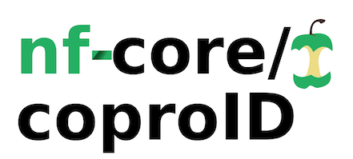

#   

## Documentation

The nf-core/coproid pipeline comes with documentation about the pipeline, found in the `docs/` directory:

1. [Installation](https://nf-co.re/usage/installation)
2. Pipeline configuration
    * [Local installation](https://nf-co.re/usage/local_installation)
    * [Adding your own system config](https://nf-co.re/usage/adding_own_config)
    * [Reference genomes](https://nf-co.re/usage/reference_genomes)
3. [Running the pipeline](docs/usage.md)
4. [Output and how to interpret the results](docs/output.md)
5. [Troubleshooting](https://nf-co.re/usage/troubleshooting)

## Introduction

**CoproID** helps you to identify the *"true maker"* of a sequenced Coprolite by checking the microbiome composition and the endogenous DNA.

The pipeline is built using [Nextflow](https://www.nextflow.io), a workflow tool to run tasks across multiple compute infrastructures in a very portable manner. It comes with docker containers making installation trivial and results highly reproducible.

## Credits

nf-core/coproid was originally written by [Maxime Borry](https://github.com/maxibor).
