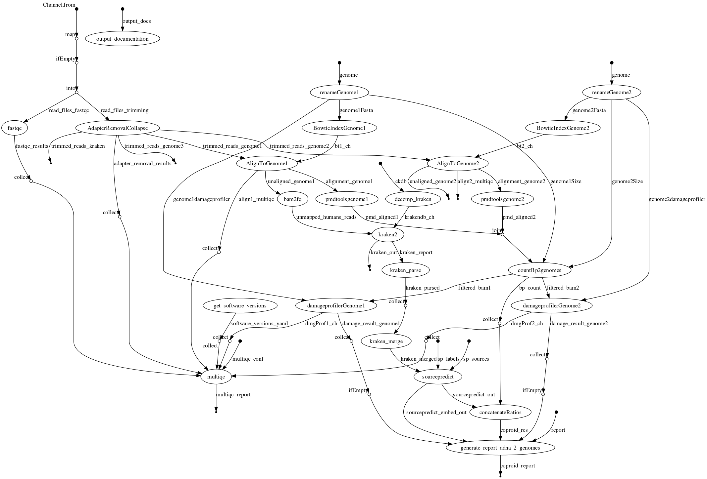

# Introduction

**coproID** (**CO**prolite **ID**entification) is a tool developed at the
[Max Planck insitute for the Science of Human History](http://www.shh.mpg.de/en)
by [Maxime Borry](https://github.com/maxibor)

The purpose of **coproID** is to help identify the host of given sequence microbiome when there is a doubt between species.

**coproID** is a pipeline developed using [Nextflow](https://www.nextflow.io/) and made available through [nf-core](https://github.com/nf-core)

Even though it was developed with coprolite host identification in mind, it can be applied to any microbiome, provided they contain host DNA.

## Quick start

Example:

    nextflow run maxibor/coproid --genome1 'GRCh37' --genome2 'CanFam3.1' --name1 'Homo_sapiens' --name2 'Canis_familiaris' --reads '*_R{1,2}.fastq.gz'

## coproID example workFlow

## How to cite coproID

The coproID article is coming.
